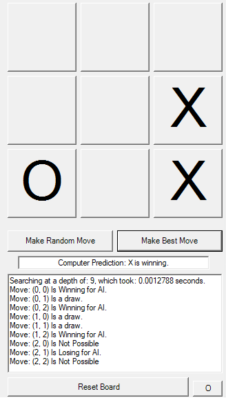

# TicTacToe AI


-%23E10098.svg?style=for-the-badge)
---

A small program that solves the game of TicTacToe using the **MiniMax algorithm** (with alpha-beta pruning), allowing the computer to play perfectly and never lose against a human player!

This project serves as an introduction to MiniMax, a key algorithm for allowing an AI opponent to play in any turn-based game - together with the alpha-beta pruning enhancement, the program is able to find all possible sequences of moves in **under 15ms** (with no additional optimisations), and use this to predict the best move to make in any given position. Resultantly, the codebase is designed to be very readable, sparse, and user-friendly, as to provide an ideal learning experience. I originally wrote this program as brief motivation for my [**Chess Artificial Intelligence**](https://github.com/AlfieKunz/Chess-Game-AI) program later that year, the <a href="https://www.alfiekunz.co.uk/academia/assets/projects/ProjectChess/Alfie%20Kunz%20Computer%20Science%20NEA%20Project%20Report.pdf#page=10" target="_blank" rel="noopener noreferrer">accompanying report</a> of which outlines the technical details of this repository.

This work is self-motivated and self-funded, and is written primarily in VB.NET as a Visual Studio console application.

<p align="center">
  
</p>

---

## Features and Highlights

✅ Implementation of the MiniMax search, exhaustively solves the entire game tree, and guaranteeing optimal play.  
✅ Optimisation through alpha-beta pruning, allowing for a ~27x speedup in performance (solving the board in under 15ms).  
✅ Depth-weighted evaluation function: rewards the fastest route to a win and the slowest route to a loss.  
✅ Chooses moves that share the best score at random, for unpredictable and 'fun' play (without sacrificing optimality).  
✅ Upon running the AI, each legal move is individually labelled as either winning, losing, or drawing for the AI, and is diaplyed on the main screen.  
✅ Live search diagnostics via a real-time progress bar for the tree traversal, the depth reached, and exact time taken in the search.  
✅ Manual user placement mode, with a toggle to switch between X and O for manual two-player or zero-player games.  
✅ Ability to play random moves, for quickly testing board states.  
✅ Win/draw/loss detection for every node, by exhaustively checking rows, columns, and diagonals for each players, falling back to draw detection when the board is full.  
✅ Automated self-play simulator on start-up, pitting the AI against a random-move opponent across unlimited games, and live-tallying wins/draws/losses in a self-updating console dashboard to statistically prove perfect play.  

---

## Project Showcase

The best way to interact with this program for full control is directly through the source code - see the instructions below.

> **Program Controls:**
>1) After opening and running the project solution in your IDE of choice, you will be initially presented with an infinite live-updating run of game statistics, with my AI playing against a random opponent, who always goes first. This is there to prove that the program is both perfect in play and efficient.
>2) Press any key to terminate this suite of games, and you will be presented with the main form. To play against the AI, simply press the "Make Best Move" or "Make Random Move" buttons to input a move for X, and input your own moves by clicking an empty square on the 3x3 grid. At any point, you can start a new game by clicking the "Reset Board" button.
>3) To allow the AI or user to play against themselves, make a move as normal, then change the player icon by pressing the bottom-right button - this allows you to toggle between each player. Repeat!

---

## Technical Details

The **MiniMax** algorithm provides a robust, "play-safe" foundation: by assuming 'perfect' play from the opponent, the algorithm guarantees mathematically optimal decisions within its search depth: we effectively *minimise* the *maximum* evaluation of all our opponent's responces to a given move, by emplyoying a depth-first search on the current position. At each leaf node, we evaluate the position, which in the game of TicTacToe means to assign a score of {+1, 0, -1}, depending on if X has won, drawn, or lost.

Henceforth, a strong chess engine can be broken down into one which searches through positions quickly and efficiently, and one that can effectively evaluate the leaf nodes of our tree.

Once a branch is proven no better than an already-found alternative, there is no need to explore it deeper: we can 'prune' the search early, saving *lots* of time. This forms the basis of Alpha-Beta Pruning.

For more information on these algorithms' intricacies, and it's specific interaction with the game of TicTacToe, see my <a href="https://www.alfiekunz.co.uk/academia/assets/projects/ProjectChess/Alfie%20Kunz%20Computer%20Science%20NEA%20Project%20Report.pdf#page=10" target="_blank" rel="noopener noreferrer">**Chess AI NEA report**</a>.

---

## Installation, and Folder Structure

### Required Software: Visual Studio (.NET 4.8).

To install, simply clone this repository using the following terminal prompts.
```bash
git clone https://github.com/AlfieKunz/TicTacToe
cd TicTacToe
```
Then, simply open the "TicTacToe.sln" file in Visual Studio.

Feel free to also fork this repository, open an issue, or submit pull requests. All contributions welcome! :)  

---

## References & Inspiration

This work is self-motivated and self-funded. If you use this code or data in your work, please cite the associated preprint:

**Text Citation:**
> Kunz, A. (2021). *TicTacToe AI*. Available at https://github.com/AlfieKunz/TicTacToe.

**BibTeX:**
```bibtex
@software{Kunz2021TicTacToe,
  title = {TicTacToe AI},
  author = {Kunz, Alfie},
  year = {2021},
  url = {https://github.com/AlfieKunz/TicTacToe}
}
```

Project inspired from work by <a href="https://www.youtube.com/watch?v=trKjYdBASyQ" target="_blank" rel="noopener noreferrer">The Coding Train</a>.